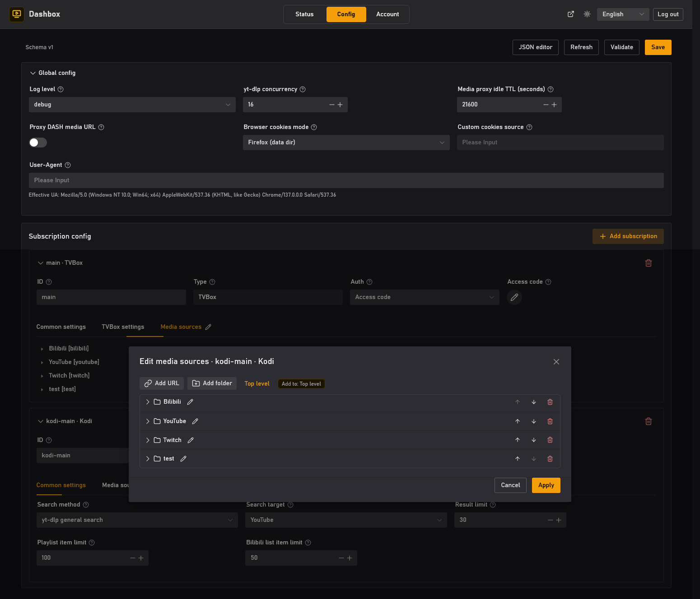
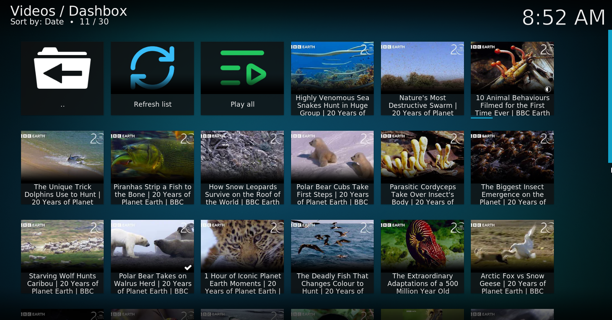
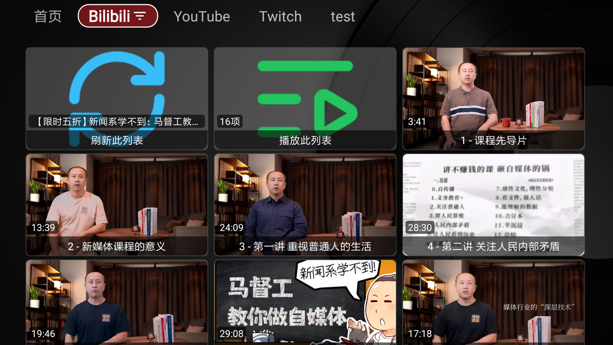

# Dashbox

[中文文档](docs/zh/README.md)

Dashbox is a small `yt-dlp`-powered media streaming service for Kodi and TVBox.

It lets you describe video sources once, then exposes them as client-ready
Kodi endpoints and TVBox subscriptions. Playback is resolved on the server with
`yt-dlp`, so clients can browse sources, open details, search, and play videos
through a local Dashbox service.

## Screenshots

Client screenshots

These screenshots show Dashbox output rendered in TVBox and Kodi clients. Third
party sites and media are shown only as configured source examples.

## Notice

Dashbox is a technical demonstration. You are responsible for how you use it and
for any consequences caused by improper use.

Dashbox is intended for local or private-network use and is not suitable as a
public internet service.

## Features

- Kodi add-on and repository endpoints served by Dashbox.
- TVBox subscription output with a built-in spider bundle.
- Server-side playback resolution through `yt-dlp`.
- HLS, progressive media URLs, DASH manifests, and optional DASH segment
  proxying.
- Image proxying for upstream hosts that need server-side handling.
- YouTube subtitle support.
- Bilibili danmaku and subtitle helpers.
- Vue admin UI for editing persisted configuration.

## Documentation

- [Installation](docs/en/installation.md)
- [Kodi and TVBox client setup](docs/en/client-setup.md)
- [Supported websites](docs/en/supported-sites.md)
- [Configuration fields](docs/en/config-fields.md)
- [Development](docs/en/development.md)
- [Example config](config.example.json)

## License

Dashbox is licensed under GPL-3.0-only. See [LICENSE](LICENSE) and
[THIRD_PARTY_NOTICES.md](THIRD_PARTY_NOTICES.md).
